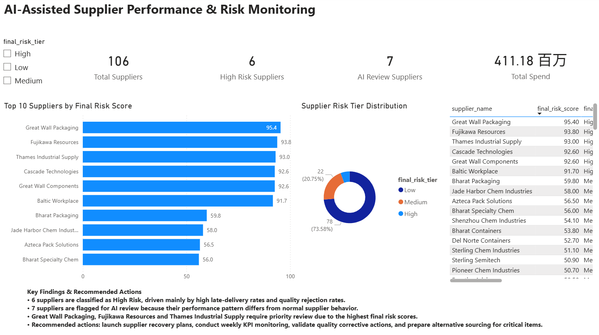

# AI 辅助供应商绩效与风险监控

[English](./README.md) | [简体中文](./README.zh-CN.md)

这是一个端到端的采购分析 Portfolio 项目，通过结合**透明、可解释的供应商 KPI 风险评分、机器学习辅助异常检测以及交互式 Power BI 仪表盘**，帮助采购人员识别和分析供应商运营风险。

> **项目说明：** 本项目使用的采购订单数据均为模拟数据。本模型旨在帮助采购人员确定供应商审查优先级，而不是自动做出采购决策，也不用于直接预测供应商是否会发生经营失败。

## 业务问题

在实际采购管理中，延期交付、质量问题、价格波动以及合同执行情况等数据往往被分开分析。

本项目将这些信息整合到统一的供应商风险分析框架中，主要回答以下四个问题：

1. 哪些供应商具有最高的运营风险？
2. 哪些因素正在推动供应商风险上升？
3. 采购团队应该优先审查哪些供应商？
4. 可以采取哪些措施降低交付与质量风险？

## 项目流程

1. 读取并验证合成采购订单数据
2. 将订单层级数据汇总形成供应商绩效评分卡。
3. 计算交付、质量、价格以及合同合规相关 KPI。
4. 构建透明、可解释的业务风险评分。
5. 使用 Isolation Forest（孤立森林）识别异常供应商绩效模式。
6. 将业务风险评分与异常检测结果结合，生成最终供应商审查优先级。
7. 使用 Power BI 展示分析结果，为采购决策提供支持。

## KPI 指标体系

| KPI | 业务含义 |
|---|---|
| 准时交付率（On-time rate） | 在承诺交付日期当天或之前完成交付的订单比例 |
| 延迟交付率（Late rate） | 超过承诺交付日期完成交付的订单比例 |
| 平均延迟天数（Average delay days） | 某供应商订单平均延迟交付天数 |
| 拒收率（Reject rate） | 因质量问题被拒收的订单比例 |
| 价格波动率（Price volatility） | 一段时间内采购单价的波动程度 |
| 非合同采购占比（Off-contract share） | 未按照既有合同执行的采购订单占比 |
| 业务风险评分（Business risk score） | 基于采购 KPI 构建的加权、可解释风险评分 |
| 异常评分（Anomaly score） | Isolation Forest 对供应商 KPI 异常程度的识别结果 |
| 最终风险评分（Final risk score） | 综合业务风险与异常信号形成的供应商审查优先级评分 |

## 核心分析结果

- 共评估 **106 家供应商**，覆盖多个国家和采购品类。
- 根据最终风险评分体系识别出 **6 家高风险供应商**。
- 使用 Isolation Forest 识别出 **7 家需要进一步进行 AI 辅助审查的供应商**。
- 分析的模拟采购支出总额达到 **4.1118 亿**。
- 风险优先级最高的供应商包括 **Great Wall Packaging、Fujikawa Resources 和 Thames Industrial Supply**。
- 高风险供应商最主要的风险来源为**交付延迟和质量拒收问题**。

## Power BI 仪表盘



Power BI 仪表盘主要包含：

- 风险等级筛选器
- 四个核心 KPI 卡片
- 最终风险评分最高的 Top 10 供应商
- 供应商风险等级分布
- 供应商层级详细信息表
- 核心分析发现与采购行动建议

通过仪表盘，采购人员可以从整体供应商组合逐步下钻至单个供应商，更快速地确定需要重点关注的对象。

## 建议采购行动

针对高风险供应商，可以采取以下行动：

- 对风险最高的供应商启动供应商绩效改善计划（Supplier Recovery Plan）。
- 每周跟踪交付和质量 KPI，直至供应商绩效恢复稳定。
- 审查供应商根因分析（Root Cause Analysis）以及纠正措施相关证据。
- 对高风险集中度的关键采购物料提前准备替代供应来源。
- 将机器学习异常检测结果作为进一步调查的提示，而不是直接将异常结果视为供应商经营失败的证据。

## 技术栈

- Python 3
- pandas
- scikit-learn
- Isolation Forest
- Power BI Desktop
- DAX
- CSV 数据分析与输出

## 项目结构

```text
supplier-risk-project/
├─ dashboard/
│  └─ Supplier_Risk_Dashboard.pbix
├─ data/
│  ├─ supplier_orders.csv
│  ├─ supplier_scorecard.csv
│  └─ supplier_risk_final.csv
├─ images/
│  └─ dashboard_overview.png
├─ report/
│  ├─ Supplier_Risk_Dashboard.pdf
│  ├─ AI_Supplier_Risk_Project_Report.docx
│  ├─ AI_Supplier_Risk_Project_Report.md
│  └─ resume_and_interview_notes.md
├─ src/
│  ├─ read_data.py
│  ├─ analyze_suppliers.py
│  └─ ai_anomaly.py
├─ requirements.txt
└─ README.md
```

## 本地运行

在项目根目录运行：

```powershell
python -m pip install -r requirements.txt
python src/read_data.py
python src/analyze_suppliers.py
python src/ai_anomaly.py
```

运行完成后预计生成：

```text
data/supplier_scorecard.csv
data/supplier_risk_final.csv
```

随后使用 Power BI Desktop 打开：

```text
dashboard/Supplier_Risk_Dashboard.pbix
```

即可查看交互式供应商风险分析仪表盘。

## 数据来源、署名与方法改编

本项目使用的订单级原始数据 `data/supplier_orders.csv`，是
[Procurement Spend Analysis Dashboard](https://github.com/dytcoke23/procurement-spend-analysis-dashboard)
项目中 `data/purchase_orders.csv` 的重命名、未修改副本。

原项目由 Harsh（GitHub 用户名 `dytcoke23`）创建，并根据 MIT
开源许可证发布。该数据为使用固定随机种子生成的合成采购数据，
不包含任何真实企业、供应商或机密采购信息。

本项目以该订单数据为分析输入，并进一步生成：

- `data/supplier_scorecard.csv`：供应商 KPI 汇总及业务风险评分
- `data/supplier_risk_final.csv`：结合业务风险评分和 Isolation Forest
  异常信号生成的最终结果

供应商 KPI 框架、风险权重与上限，以及
`StandardScaler + IsolationForest` 方法参考并改编自上述开源项目。
本项目进一步调整了分析流程，采用 70% 业务评分与 30% 异常评分的
组合方式，将异常比例设置为 6%，并重新制作了 Power BI 可视化及
项目报告。

原项目的版权与 MIT 许可证全文保留在
[THIRD_PARTY_NOTICES.md](./THIRD_PARTY_NOTICES.md)。

## 风险治理与项目局限

- 本项目数据均为模拟数据，不包含任何真实或机密的供应商信息。
- KPI 权重与风险阈值属于业务规则，在实际企业应用中应由采购及相关业务部门共同校准。
- Isolation Forest 用于识别异常表现模式，但无法直接解释异常产生的根本原因，也不能证明供应商一定存在经营问题。
- 对于采购订单数量较少的供应商，其部分比例型 KPI 可能存在较大波动，因此实际分析时需要同时考虑样本量。
- 本项目未指定采购金额的具体币种，因此相关采购支出数据不应被解释为任何真实企业的财务数据。
- 最终采购、供应商选择或替代供应决策仍需由采购人员结合实际运营证据进行人工判断。

## 项目交付物

项目中包含：

- Power BI 交互式仪表盘：`dashboard/Supplier_Risk_Dashboard.pbix`
- Power BI 仪表盘 PDF：`report/Supplier_Risk_Dashboard.pdf`
- 完整项目报告：`report/AI_Supplier_Risk_Project_Report.docx`
- 简历与面试说明：`report/resume_and_interview_notes.md`

## 联系方式

如果你对本项目有任何问题、建议或合作想法，欢迎与我联系。

- 邮箱：**peiyuan856@gmail.com**
- GitHub：**@peiyuan856-hue**
